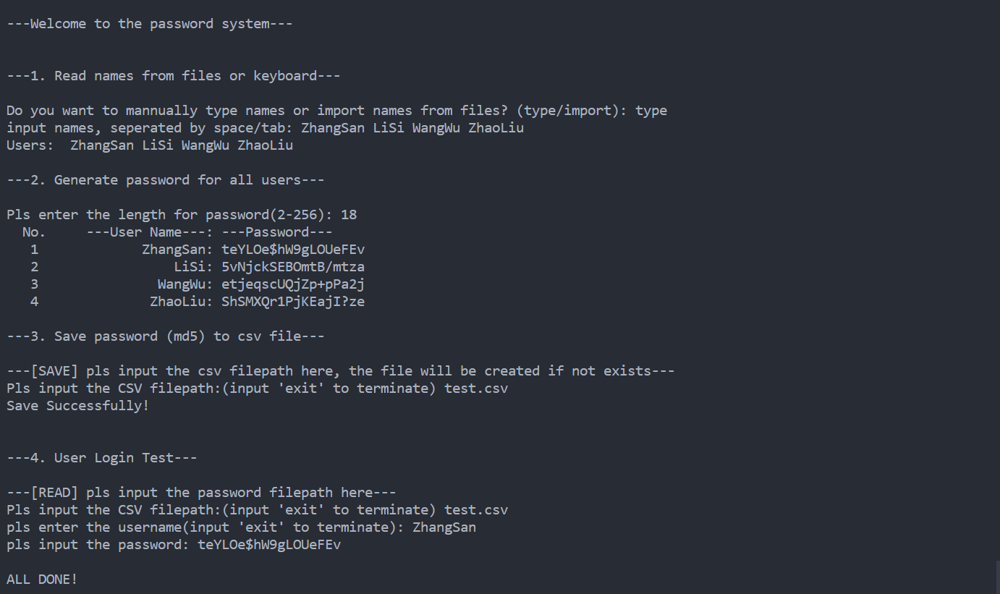

# Python

## 题目

系统初始化为用户生成初始密码，生成的密码要求是随机生成的，并且生成的密码包含一串字符，其中一位数字和一位特殊字符；

## 思路

1. 整个包有主要包括下属5个模块，每个模块都有相应的测试函数。
2. 一个生成姓名列表的模块`read_name`，姓名可以手动输入，也可以从文件读取。为了方便，这里强制从csv文件的第一列直接读取。如果进行功能扩充也是可以从其它类型的文件读取的，也可以实现按列读取。
3. 一个为用户生成一批密码的模块`generate_passwoed`。根据题意，密码必须包含一个数字和一个特殊字符。主要利用了`random`模块中的`random.choice()`和`random.shuffle()`来保证随机性。这里预留了设置密码强度的接口，便于以后修改密码复杂度规则，也提供了是否大小写字母的选项。注意，明文密码是以字典形式保存的，其键为用户名，值为密码。
4. 一个保存密码到文件和从文件读取密码的模块`password_file`。为了数据安全，密码在文件读取时只保存其`md5`值，从文件读取校验也是校验其哈希值。为了方便起见，这里的文件统一用`.csv`格式的文件。
5. 一个检验用户密码正确性，模拟用户登录过程的模块`check_password`。用户输入用户名，密码，密码保存的文件，程序通过读取密码，进行哈希计算，与文件中保存的哈希值进行比对。如果正确，则输入用户登录的`Token`，这里还没有对`Token`进行完善，有待进一步提高。如果三次密码错误，则强制退出程序。
6. 一个检验整个包功能的模块`test_function`，按照上述流程一一验证各模块的功能。

## 代码

### `__init__`

```python
import os
import random
import hashlib

```

### `__main__`

```python
import test_function
"""
test
"""
test_function.test_function()

```

### `test_function`

```python
import read_names, generate_password, password_file, check_password

"""
test all the functions in this module
"""

def test_function():
    """
    test all the functions in this module
    """
    print("\n---Welcome to the password system---\n")
    print("\n---1. Read names from files or keyboard---\n")
    userList = read_names.readUserName()
    print("Users: ", *userList)

    print("\n---2. Generate password for all users---\n")
    passLength = generate_password.setPassLength()
    passDict = generate_password.userPasswords(userList, passLength)
    generate_password.printPasswords(passDict)

    print("\n---3. Save password (md5) to csv file---\n")
    password_file.savePassword(passDict)
    print("Save Successfully!\n")

    print("\n---4. User Login Test---\n")
    md5Dict = password_file.readPassword()
    check_password.mockLogin(md5Dict)

    print("\nALL DONE! \n")

```

### `read_names`

```python
from os.path import exists as file_exists
from csv import reader as csv_reader

"""
return a list of names from a file or the keyboard
"""

def readUserName() -> list:
    """
    easy to input/import lots of names
    return a list of names
    """
    state = input("Do you want to mannually type names or import names from files? (type/import): ")
    while state not in ['type', 'import']:
        state = input("Invalid value, pls enter again: ")
    if state=='type':
        return inputUserName()
    else:
        return importUserName()
        
def inputFilepathCSV() -> str:
    """
    input the filepath of a CSV file
    check the validity of the filepath
    """
    filepath = input("Pls input the CSV filepath:(input 'exit' to terminate) ").strip('"')
    # only usable for .csv files on your computer, only tested on Win10 
    while not filepath.endswith(".csv"):
        if filepath == "exit":
            raise Exception("User quit the program mannually")
        filepath = input("Invalid value! Pls input the CSV filepath: ").strip('"')

    return filepath
    
def importUserName() -> list:
    """
    MUST import os before use
    only applicalbe for .csv files
    names must stored in the first column
    return a list of names
    """
    filepath = inputFilepathCSV()
    while not file_exists(filepath):
        print("file not found")
        filepath = inputFilepathCSV()
    # only usable for small files(less than 10,000 lines, can't used in big data)
    with open(filepath, 'r') as f:
        f_csv = csv_reader(f)
        # name must be stored in first column or we need do further preprocess
        nameList = [row[0].strip('\n') for row in f_csv]
    return nameList
    
def inputUserName() -> list:
    """
    input names mannually
    return a list of names
    """
    nameList = input("input names, seperated by space/tab: ")
    return nameList.split()

if __name__ == '__main__':
   print(*readUserName())

```

### `generate_password`

```python
from random import choice, shuffle

"""
generate a password dict for all users
"""

def charLibrary() -> dict:
    """
    generate a char libray, easy to adjust the characters in your password
    """
    specChar = "+-*/?!@#$%&"
    numsChar = [str(i) for i in range(10)]
    alphaChar = [chr(i+ord('a')) for i in range(26)] + [chr(i+ord('A')) for i in range(26)]
    alphaChar_upper = [chr(i+ord('A')) for i in range(26)]
    alphaChar_lower = [chr(i+ord('a')) for i in range(26)]
    return {"spec": specChar, "num": numsChar, "alpha": alphaChar, "alpha_upper": alphaChar_upper, "alpha_lower": alphaChar_lower}

def setPassLength() -> int:
    """
    set the length of password
    """
    length = input("Pls enter the length for password(2-256): ")
    while (not length.isdigit() or not 2 <= int(length) <= 256):
        length = input("Invalid input! \nPls enter the length for password(2-256): ")
    return int(length)

def generatePassword(length = 2, alphaState = 0, passStrenth = 0) -> str:
    """
    MUST import random befor use
    generate a password for one user
    include one number and one special char
    length(2): password length
        2: minimum length for this function
    alphaState(0): check if you need upper cases or lower cases or both
        0: both upper cases and lower cases, 1: upper cases, 2: lower cases
    passStrength(0): set pass word strength, reserved for future version
        0: default state, include one number and one special char 
    """
    if alphaState == 0:
        alphaChar = charLibrary()["alpha"]
    elif alphaState == 1:
        alphaChar = charLibrary()["alpha_upper"]
    elif alphaState == 2:
        alphaChar = charLibrary()["alpha_lower"]
    else:
        raise ValueError("Invalid alphaState")
        
    password = []
    # generate (length-2) letters
    for counts in range(length-2):
        password.append(choice(alphaChar))
        counts += 0 # avoid 'not used' error alert
    password.append(choice(charLibrary()["num"]))
    password.append(choice(charLibrary()["spec"]))
    shuffle(password)
    return "".join(password)

def userPasswords(userList, length) -> dict:
    """
    generate a password for every single user in user list
    """
    passDict = {}
    for user in userList:
        passDict[user] = generatePassword(length)
    return passDict

def printPasswords(passDict):
    formatSpec = "{0: ^8} {1:>16}: {2:<}"
    print(formatSpec.format("No. ", "---User Name---", "---Password---"))
    index = 0
    for user_pass in passDict:
        index += 1
        print(formatSpec.format(index, user_pass, passDict[user_pass]))

if __name__ == "__main__":
    test_names = ["ZhangSan", "LiSi", "WangWu", "ZhaoLiu"]
    test_length = 8
    printPasswords(userPasswords(test_names, test_length))
    
```

### `password_file`

```python
from hashlib import md5
from csv import writer as csv_writer
from csv import DictReader as csv_dictreader
import read_names, generate_password
from os.path import exists as file_exists

"""
save the password dict to file
or read a password from a file
password must be stored in md5 value
"""

def md5PassDict(passDict) -> dict:
    """
    for the safety of your password, we only save the md5 value of your password
    """
    md5Dict = {}
    dict.fromkeys(passDict.keys(), ' ')
    for each in passDict.keys():
        md5Dict[each] = md5(passDict[each].encode(encoding='UTF-8')).hexdigest()
    return md5Dict   

def savePassword(passDict) -> dict:
    """
    save the md5 value of password
    """
    md5Dict = md5PassDict(passDict)
    print("---[SAVE] pls input the csv filepath here, the file will be created if not exists---")
    filepath = read_names.inputFilepathCSV()
    header = ["name", "password"]
    with open(filepath, 'a+', newline="") as f:
        writer = csv_writer(f)
        writer.writerow(header)
        for item in md5Dict.items():
            writer.writerow(item)

def readPassword() -> dict:
    """
    read the md5 value of password from files and used to check password
    """
    print("---[READ] pls input the password filepath here---")
    filepath = read_names.inputFilepathCSV()
    while not file_exists(filepath):
        print("file not found")
        filepath = read_names.inputFilepathCSV()
    with open(filepath, 'r') as f:
        md5Dict = {}
        reader = csv_dictreader(f)
        for row in reader:
            md5Dict[row['name']]=row['password']
    return md5Dict

if __name__ == "__main__":
    testDict = {"ZhangSan": "3sqDf/UG", 
                "LiSi": "TlFHs-6r", 
                "WangWu": "yPJH8o@i", 
                "ZhaoLiu": "k8#hqhwJ"}
    generate_password.printPasswords(testDict)
    savePassword(testDict)
    md5Dict = readPassword()
    generate_password.printPasswords(md5Dict)

```

### `check_password`

```python
from hashlib import md5
import password_file

"""
simulate login process and check the validity of the password
generate a Token if you enter the right username and password
"""

def mockLogin(md5Dict):
    """
    simulate the process of user login
    you must give 
    """
    # maximum times to try your password
    for counts in range(3):
        name = input("pls enter the username(input 'exit' to terminate): ")
        if name == "exit":
            return False
        password = input("pls input the password: ")
        if checkPassword(name, password, md5Dict):
            Token = genToken(name)
            return Token
        else:
            print("invalid username and password")
        counts += 0 # avoid 'counts not used' error alert
    print("the time you try exceed the max value 3")
    return False

def genToken(username="null", expire=60):
    """
    will be updated in future version
    (to be updated)
    """
    token = "LoginSuccesfully"
    return token

def checkPassword(name, password, md5Dict):
    """
    for the safety of your password
    we only check the MD5 checksum
    """
    if name not in md5Dict.keys():
        return False
    elif md5(password.encode(encoding='UTF-8')).hexdigest() != md5Dict[name]:
        return False
    else:
        return True

if __name__ == "__main__":
    md5Dict = password_file.readPassword()
    outcome = mockLogin(md5Dict)
    if outcome:
        print("Login Successfully! Your token is ", outcome)
    else:
        print("Invalid login infomation, see you next time!")

```

## 测试环境

```
Visual Studio Code
版本: 1.50.1 (user setup)
提交: d2e414d9e4239a252d1ab117bd7067f125afd80a
日期: 2020-10-13T15:06:15.712Z
Electron: 9.2.1
Chrome: 83.0.4103.122
Node.js: 12.14.1
V8: 8.3.110.13-electron.0
OS: Windows_NT x64 10.0.19041
```

## 运行截图

